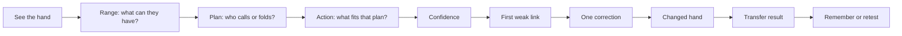

# Range Coach V2 — UX and QA specification

**Status:** Implementation baseline  
**Release:** Reasoning Diagnostic Beta  
**Primary device:** Personal phone used after, before, or away from a live cash session  
**Primary learner:** An improving live-cash NLHE player who knows basic rules and hand rankings but is inconsistent in postflop reasoning  
**Product promise:** Find the first weak link in the learner's thinking, teach one correction, and test whether it transfers to a changed hand.

This document is the design and verification contract for V2. Program-level IDs reference the canonical [`v2-requirements.md`](./v2-requirements.md) catalogue. IDs beginning `UXQ-` identify detailed UX/QA cases within canonical test suites; they do not create additional product requirements.

## 1. Experience principles

1. **Train a decision, not vocabulary.** The visible loop is always **Range → Plan → Action**. Terms such as *capped* appear only after the learner has reasoned about whether strong hands still fit.
2. **Diagnose one thing at a time.** Feedback leads with the first material broken link. Later consequences are shown as effects, not additional independent failures.
3. **Prove transfer.** A corrected answer is not mastery. The learner must make a decision in an approved twin hand where exactly one strategic fact changes.
4. **Keep poker truth auditable.** Computed facts, reviewed strategy, population assumptions, player-specific inferences, and authored examples are never presented as equivalent evidence.
5. **Respect incomplete information.** The coach can say that multiple actions are reasonable. Exact sizes and mixed frequencies do not count as objective mastery unless validated.
6. **Move at phone speed.** One primary action per state, no glossary detours, no repeated hand history, and no required progressive disclosure.
7. **Remember the learner.** Resume state, first answers, confidence, diagnosis, transfer result, content version, and delayed-retention result persist.
8. **Never assist live play.** Training and hand review occur away from an active hand. V2 does not provide real-time assistance.

### 1.1 Core mental model

The learner should be able to describe this loop after one completed hand without reopening explanatory text. This is the comprehension gate for `GOAL-001`, `GOAL-005`, `AC-015`, and `TEST-023`.

## 2. Phone-first journey

### Journey JRN-001 — New learner diagnostic

| Step | Learner sees | Learner does | System does | Primary requirement references |
|---|---|---|---|---|
| 1 | A single promise, expected time, device-local storage note, and **Start diagnostic** | Starts | Creates a pseudonymous device-local learner profile and diagnostic session | `US-001`, `FR-001`, `FR-012`, `AC-001`, `AC-021` |
| 2 | A compact hand, current decision, full action history, and Question 1 | Chooses the opponent's likely range | Saves the immutable first answer | `US-002`, `FR-003`, `DATA-003` |
| 3 | Question 2 | Chooses the plan: get called by weaker hands, make better hands fold, call at a good price, or avoid building a larger pot | Saves the plan without revealing correctness | `US-002`, `FR-003` |
| 4 | Question 3 | Chooses an action or approved size family | Saves the action and checks action-purpose coherence | `US-002`, `FR-003`, `FR-005` |
| 5 | Confidence selector | Chooses Guessing, Somewhat sure, or Very sure | Stores confidence before feedback | `US-003`, `FR-004`, `DATA-003` |
| 6 | One verdict and a connected Range → Plan → Action chain | Reads the first weak link and one table rule | Runs deterministic, versioned evaluation; records provenance | `US-004`, `FR-005`, `FR-006`, `FR-011`, `FR-017` |
| 7 | **Try the changed hand** | Continues | Loads the approved twin and explicitly labels the one changed fact | `US-005`, `FR-007`, `FR-008` |
| 8 | The same three-decision loop at table speed | Answers | Scores transfer independently of coached correction | `US-005`, `FR-009` |
| 9 | Transfer result | Reads what transferred and what still needs work | Updates the reasoning profile and schedules a retest when appropriate | `US-005`, `US-007`, `FR-009`, `FR-014`, `FR-016` |
| 10 | Session home | Continues or leaves | Persists exact resume point and pending work on this device | `US-001`, `US-007`, `FR-012` |

### Journey JRN-002 — Returning learner

1. The home screen leads with **Continue: [skill]** and the exact pending state.
2. A secondary line says why it was selected, for example: “This tests whether you still remove strong hands too quickly.”
3. If a delayed retest is due, **Retest one skill** is primary and the learner is told it takes about two minutes.
4. If no retest is due, the next targeted hand is primary.
5. Historical percentages never displace the next useful action.

References: `US-001`, `US-007`, `FR-001`, `FR-014`–`FR-016`, `FR-019`, `AC-001`, `AC-012`–`AC-014`.

### Journey JRN-003 — Interrupted learner

If the app closes after any submitted answer, it resumes after that answer; it never asks the learner to recreate it. If it closes before an answer is submitted, no answer is inferred. A resumed hand shows “Welcome back” once, then returns to the exact state without a modal.

References: `FR-012`, `AC-010`, `TEST-010` (detailed cases `UXQ-REC-01` through `UXQ-REC-06`).

## 3. Information architecture

V2 has four primary destinations:

- **Today:** the next diagnostic, twin, or retest.
- **My thinking:** the six controlled reasoning links, recent evidence, and trend.
- **Hands:** completed hand families and their versions.
- **About the coaching:** methodology, provenance legend, limitations, privacy, and educational-use boundary.

Do not add a permanent bottom-navigation item unless usability testing shows that learners need to move between these destinations during a session. During a hand, the training sequence owns the screen. A quiet exit returns to Today after confirmation only when an answer would otherwise be lost.

## 4. Screen requirements

### SCR-001 — Today / resume

**Purpose:** Put the learner into the most valuable next exercise with one tap.

Required content, in order:

1. Product promise in one sentence.
2. Primary card: exercise name, skill being tested, why it was selected, approximate duration, and one primary button.
3. Session progress, expressed as completed exercises rather than an unexplained percentage.
4. At most one secondary card: due retest or diagnostic summary.
5. Link to My thinking.

States:

- New: **Start diagnostic**.
- In progress: **Continue hand** with “Question 2 of 3,” “See correction,” or “Changed hand,” as applicable.
- Retest due: **Retest one skill**.
- Session complete: concise achievement plus **Train another skill**.
- No content/network failure: preserved local progress, a retry, and no fabricated recommendation.

Acceptance: The primary action is visible at 320 × 568 CSS pixels without scrolling; `AC-001`, `AC-018`, `TEST-001`, `TEST-018` (`UXQ-HOME-01`).

### SCR-002 — Hand decision

**Purpose:** Let the learner understand the spot and answer without repeatedly rereading it.

Required hierarchy:

1. Eyebrow: lesson/skill and “Question n of 3.”
2. Current decision: street, pot, effective stack if strategically relevant, and action on **You**.
3. Cards: Your hand and Board, rendered as recognizable cards with text alternatives.
4. Opponent evidence, only if it is an explicit scenario fact. Label **Observed**, not “Read.”
5. Full hand history in four aligned street rows. It remains directly visible for every decision question and is never required progressive disclosure.
6. One complete-sentence question.
7. Mutually exclusive answer buttons.

Rules:

- Use **You** and **Opponent**, not Hero/Villain, in the primary teaching interface.
- A street row must name both actors when needed to remove ambiguity.
- The current board is rendered once. History rows may name newly dealt cards but must not reproduce five-card board tiles.
- Never repeat a prose summary that merely restates the history.
- Explain poker terms inline the first time: “Strong hands still fit (often called uncapped).”
- For Range, use frequency buckets: **Most often**, **Sometimes**, **Still possible**.
- Answers remain selected after navigating back, but the initial submitted answer remains immutable in the learning record.

Acceptance: A beginner-intermediate trainee can identify position, street, current pot, action order, and decision in 15 seconds; `AC-018`, `TEST-018`, `TEST-023` (`UXQ-HAND-01`).

### SCR-003 — Confidence

**Purpose:** Calibrate certainty before the answer is revealed.

Question: **How sure are you about the reasoning you just used?**

Choices:

- **Guessing** — I mostly chose an answer.
- **Somewhat sure** — I can give a reason, but I may be missing hands.
- **Very sure** — I can name the hands and explain why the action fits.

Confidence is about the whole chain, not bravado or emotional comfort. No choice is visually marked as desirable. It is always captured before feedback and cannot be changed afterward for the recorded attempt.

Acceptance: all three choices have equal visual weight and plain-language definitions; `AC-003`, `AC-012`, `TEST-003`, `TEST-012`, `TEST-018` (`UXQ-CONF-01`).

### SCR-004 — Diagnostic result

**Purpose:** Make correct, alternative, and incorrect reasoning immediately distinguishable.

Required hierarchy:

1. **Overall verdict**
2. **n of 3 thinking links line up**
3. Connected chain: Range → Plan → Action
4. First weak link and one correction, if applicable
5. **Remember this** table rule
6. Primary action: **Try the changed hand**
7. One optional disclosure: **See the coach's reasoning**

Each chain row contains:

- the learner's answer;
- a text status, not color alone;
- the reviewed answer or “Try instead” only if needed;
- no more than two concise sentences.

The result does not treat a downstream action as an independent conceptual mistake when it follows logically from a faulty range. Instead: “Your action follows your plan, but the range assumption needs work.”

#### Correct path (`STATE-CORRECT`)

- Verdict: **Your reasoning works.**
- Status: **Matches the lesson** for each required link.
- Coaching: one reinforcement explaining the decisive relationship.
- Primary action still tests transfer; it does not say the skill is mastered.

#### Reasonable-alternative path (`STATE-ALT`)

- Verdict: **Your plan is reasonable.**
- Status: **Reasonable option** on the affected row.
- The app states which assumptions support the choice and when the reviewed baseline differs.
- No red error styling, no false precision, and no mastery penalty unless the scenario's acceptance set says otherwise.

#### Correction path (`STATE-FIX`)

- Verdict: **One thinking link needs work.**
- Status: **Needs change** on the first material broken link.
- Show the learner's choice, the corrected thought, and the consequence downstream.
- Primary action: **Practice this change** or **Try the changed hand**, depending on content configuration.

#### Contradiction path (`STATE-CONTRADICTION`)

- Verdict: **Your action does not match your plan.**
- Example: plan says make better hands fold; action says check.
- The coach asks the learner to repair Action while retaining the valid Range and Plan.

#### Unsupported-exactness path (`STATE-UNVERIFIED`)

- The strategic category can pass while an exact size remains ungraded.
- Copy: “The value-betting idea is the lesson. This exact size is an authored example, not solver-verified.”
- Exact unverified sizes do not increase or decrease mastery.

Acceptance: A learner can say what was right, what needs changing, and what to do next after a five-second glance; `AC-015`, `TEST-015`, `TEST-023` (`UXQ-RESULT-01`).

### SCR-005 — Coach reasoning disclosure

This is the only optional disclosure on a result. It contains:

- **Why:** likely range buckets and why the line supports them.
- **Baseline:** recommendation without a reliable player-specific adjustment.
- **If the evidence is reliable:** exploit adjustment.
- **Change course when:** reversal condition.
- **Evidence:** a provenance label with a plain-language definition.
- **Math:** only computed and relevant quantities, such as pot odds or required fold percentage.

It must not introduce a new required concept that is absent from the visible result. Closing the disclosure returns to the same scroll/focus position.

References: `FR-010`, `FR-011`, `FR-017`, `FR-018`, `NFR-008`, `AC-008`, `AC-009`, `AC-015`, `AC-016`, `TEST-008`, `TEST-009`, `TEST-015`, `TEST-016`, `TEST-018`.

### SCR-006 — Twin introduction

**Purpose:** Make causality explicit without revealing the new answer.

Show:

- **Changed hand**
- **Only this changed:** one fact, visually contrasted with the base hand
- **Everything else stays the same**
- the skill being retested
- primary action **Decide again**

Do not say whether the correct action changes. The twin record must declare exactly one strategic variable, and the UI must derive the comparison from the content record rather than free text.

Acceptance: the learner can name the changed variable before answering; `AC-006`, `TEST-006` (`UXQ-TWIN-01`).

### SCR-007 — Twin decision and transfer result

The twin uses the same Range → Plan → Action structure to reduce interface-learning effects. It defaults to table speed: three compact questions followed by **Review my thinking**. Confidence is captured again.

The transfer result says one of:

- **Transferred:** “You adjusted the reasoning because [changed fact].”
- **Principle held:** “You kept the decision because [changed fact] did not alter [decisive relationship].”
- **Needs another example:** identifies the same or a newly exposed first broken link.

It explicitly distinguishes “the action changed” from “the reasoning changed.” Repeating the base-hand action is not automatically wrong; the approved twin defines whether the lesson should reverse or hold.

Acceptance: transfer is scored using the twin's reviewed answer set and content version, never by simply comparing the two action strings; `AC-006`, `AC-007`, `TEST-006`, `TEST-007` (detailed cases `UXQ-TWIN-02` through `UXQ-TWIN-07`).

### SCR-008 — My thinking

Show the six controlled leak categories in learner language:

1. Keeping strong hands in the opponent's range
2. Finding weaker hands that can call
3. Bluffing hands that actually beat you
4. Matching the action to the plan
5. Using the price of a call
6. Treating player evidence with the right confidence

For each category show:

- current state: **Needs examples**, **Learning**, **Holding up**, or **Not enough evidence**;
- the number of independent hand families supporting the state;
- confidence-calibration note when relevant;
- last trained and next retest;
- one representative table rule.

Do not use a single opaque overall score. Do not describe a permanent personal trait (“You are bad at ranges”). Use evidence-limited language (“In 2 of 3 recent hand families…”).

References: `FR-014`, `FR-019`, `AC-012`, `TEST-012` (detailed cases `UXQ-PROFILE-01` through `UXQ-PROFILE-06`).

### SCR-009 — Delayed retest

**Purpose:** Test retention without giving away the original answer.

Requirements:

- Use an unseen or approved altered hand from the same skill family.
- Do not display the previous table rule before the answer.
- Use the standard three-link loop and confidence question.
- Result distinguishes retained reasoning, partial retention, and recurrence.
- If the learner misses the same link, schedule a new varied example; do not immediately replay identical cards.
- Clearly label simulated time in test environments; production never pretends a seven-day interval elapsed.

Acceptance: the retest is tied to the original diagnosis and content versions, while its answers remain independently evaluated; `FR-013`, `FR-016`, `AC-011`, `AC-014`, `TEST-011`, `TEST-014` (detailed cases `UXQ-RET-01` through `UXQ-RET-08`).

### SCR-010 — Saved progress and reset

**Purpose:** Make the beta's memory useful without implying an account or cloud backup.

The progress/About experience must state:

- **Saved on this device:** attempts, confidence, diagnoses, twins, profile, and due retests;
- **Not backed up:** progress does not automatically follow the learner to another browser or device;
- clearing browser/site data or using private browsing can remove or isolate progress;
- no real name, financial credential, exact casino location, or raw audio is stored by the beta;
- **Reset progress on this device** is destructive and separate from ordinary navigation.

Reset opens an accessible confirmation dialog that identifies Range Coach data as the exact target, explains that the deletion cannot be recovered, and offers **Cancel** as the initially focused action. Confirming removes only namespaced Range Coach beta records, returns to the fresh diagnostic state, and does not clear unrelated site/browser storage. If storage is unavailable, the UI labels the current work **Temporary — closes when you leave** before the learner relies on saved progress.

References: `FR-012`, `FR-021`, `DATA-008`, `DATA-010`, `NFR-012`, `AC-010`, `AC-017`, `AC-021`, `TEST-010`, `TEST-017`, `TEST-021`.

## 5. Interaction and visual design standards

### 5.1 Layout

- Design for 320–430 CSS-pixel widths first; enhance at larger sizes.
- Keep a readable measure of roughly 35–55 characters for coaching prose.
- One primary action per state. Secondary actions use quieter styling and do not compete spatially.
- A fixed action bar is allowed only when it does not cover cards, feedback, the on-screen keyboard, or browser controls.
- Every decision screen keeps the full history visible in a compact, stable four-street layout. Later questions may reduce decorative detail, but the learner never has to open a disclosure or scroll to a previous screen to reconstruct the line.
- On desktop, preserve the same reading order; do not scatter related information into a dashboard simply because width is available.

### 5.2 Typography and copy

- Base text: at least 17 CSS pixels on phone; line height at least 1.45.
- Questions: at least 22 CSS pixels and written as full sentences.
- Labels may be smaller but never below 14 CSS pixels.
- Avoid fragments such as “Range inference” or “Control pot” without a complete explanatory sentence.
- Prefer concrete language: “Which weaker hands can call?” over “What is your value target?”
- Explain purpose before terminology: “Few strongest hands still fit, so the range is mostly capped.”
- Do not use “right/wrong” when multiple reviewed answers are acceptable. Use **Matches lesson**, **Reasonable option**, and **Needs change**.
- Copy must distinguish opponent behavior stated in the scenario from an inference made by the learner.

### 5.3 Color and affordance

- Correct, alternative, and correction states must each have icon, label, and shape/border treatment in addition to color.
- Recommended semantic palette roles: success, alternative/caution, correction, neutral information. Exact tokens are defined in design implementation.
- Answer options are visibly tappable cards with a selected state, focus state, disabled/locked state, and pressed feedback.
- Do not make the entire product look like a status dashboard. Cards, chips, and colored surfaces appear only where they encode hierarchy or meaning.

### 5.4 Motion

- Motion is optional reinforcement, never required to understand state.
- Respect `prefers-reduced-motion`.
- No countdowns, celebratory confetti, shaking errors, or casino-like urgency.
- Progress transitions must not shift the answer the learner is about to tap.

## 6. Accessibility requirements

V2 targets WCAG 2.2 AA for authored UI and content.

| UX detail ID | Requirement | Canonical verification |
|---|---|---|
| `UX-A11Y-01` | All functionality is keyboard-operable with visible focus and logical order. | `NFR-003`, `AC-018`, `TEST-018` |
| `UX-A11Y-02` | Tap targets are at least 44 × 44 CSS pixels with sufficient separation. | `NFR-002`, `AC-018`, `TEST-018` |
| `UX-A11Y-03` | Text and UI-component contrast meet AA. | `NFR-003`, `AC-018`, `TEST-018` |
| `UX-A11Y-04` | Status is not communicated by color alone. | `NFR-004`, `AC-018`, `TEST-018` |
| `UX-A11Y-05` | Playing cards have accessible names such as “Ace of spades”; red/black coloring is not the only suit indicator. | `NFR-003`, `NFR-004`, `AC-018`, `TEST-018` |
| `UX-A11Y-06` | New feedback receives an appropriate focus move or polite live announcement without rereading the entire page. | `NFR-003`, `AC-018`, `TEST-018` |
| `UX-A11Y-07` | Disclosures expose expanded state and restore focus on close. | `NFR-003`, `AC-018`, `TEST-018` |
| `UX-A11Y-08` | Zoom to 200%, text spacing overrides, and 320 CSS-pixel reflow do not hide information or cause two-dimensional scrolling. | `NFR-002`, `NFR-003`, `AC-018`, `TEST-018` |
| `UX-A11Y-09` | Reduced motion and high-contrast/forced-color modes retain all state cues. | `NFR-004`, `AC-018`, `TEST-018` |
| `UX-A11Y-10` | Plain-language alternatives exist for unfamiliar poker terminology. | `NFR-009`, `AC-015`, `TEST-015`, `TEST-023` |

Screen-reader reading order for a hand is: progress → current decision → your cards → board → opponent evidence → action history → question → answers → continue. Decorative suit glyphs are hidden when the card's accessible name already includes the suit.

## 7. Persistence and recovery

### 7.1 Persisted attempt contract

After every submission, persist at minimum:

- learner/session ID;
- base hand family, scenario ID, scenario version, and evaluator version;
- support/pace mode;
- immutable first Range, Plan, and Action answers;
- confidence captured before feedback;
- accepted-alternative status;
- first broken link and deterministic rule ID;
- claim/provenance versions used in feedback;
- twin ID and the one changed variable;
- transfer result;
- timestamps and completion state.

Edits made while merely navigating back may affect the visible worksheet but never overwrite the first submitted answer. If retry is permitted, it creates a linked new attempt.

### 7.2 Recovery states

| Failure moment | Expected recovery |
|---|---|
| Before an answer | Resume with no inferred selection. |
| After selection, before submit | Resume to the question; local selection may be restored but is not counted until submitted. |
| After submit, before next screen | Resume after the submitted answer and never double-count it. |
| During result | Resume to the same result, including disclosure state only if useful; never re-grade against a newer content version. |
| During twin | Resume to the exact twin step and preserve the base attempt link. |
| Offline | Continue using bundled authored content and device-local persistence; no server sync is required by the beta. |
| Content withdrawn | Preserve historical result with its version and explain that the hand is no longer used for new training. |
| Storage unavailable | Explain that progress cannot be saved before allowing the learner to continue as a clearly labeled temporary session. |

### 7.3 Idempotency and version integrity

- Every answer submission has a client-generated idempotency key within the local repository.
- Repeated UI events or reload recovery create one answer record and one local event outcome.
- Historical attempts are always evaluated/displayed with the recorded evaluator and content versions.
- A corrected scenario creates a new version. It never silently changes a prior result.
- The beta makes no cloud-backup or cross-device-recovery claim. Changing browser/device or clearing site data may isolate or remove progress; this limitation is disclosed before or at the first saved result and remains available in the progress view.

References: `FR-012`, `FR-013`, `FR-021`, `DATA-003`–`DATA-006`, `DATA-008`–`DATA-010`, `NFR-012`, `AC-010`, `AC-011`, `AC-017`, `AC-021`, `TEST-010`, `TEST-011`, `TEST-017`, `TEST-021`.

## 8. Instrumentation

Instrumentation exists to test learning and usability, not to optimize gambling engagement. In the device-local beta, these events form a documented local/test event contract and **are not transmitted by the core training flow**. Future opt-in telemetry would require a separate privacy requirement and consent decision. Never put hole cards, opponent notes, free text, or raw answer text in generic event payloads.

### 8.1 Event catalogue

| Event | Required properties | Why |
|---|---|---|
| `diagnostic_started` | session_id, content_pack_version, entry_point | Activation funnel |
| `hand_viewed` | session_id, attempt_id, scenario_id, scenario_version, skill_id, twin/base/retest | Exposure and resume integrity |
| `answer_submitted` | attempt_id, link_id, option_id, first_answer, response_ms, evaluator_version | Decision behavior; no answer text |
| `confidence_submitted` | attempt_id, confidence_level, response_ms | Calibration |
| `diagnosis_viewed` | attempt_id, first_broken_link, outcome_class, provenance_classes | Result delivery |
| `reasoning_opened` | attempt_id, source_screen | Disclosure usefulness |
| `twin_started` | base_attempt_id, twin_id, changed_variable_type | Transfer funnel |
| `twin_completed` | base_attempt_id, twin_attempt_id, transfer_class | Primary learning outcome |
| `retest_due_shown` | learner_id, skill_id, days_since_training | Scheduling integrity |
| `retest_completed` | source_attempt_id, retest_attempt_id, retention_class | Retention outcome |
| `session_resumed` | session_id, resume_state, elapsed_ms | Recovery quality |
| `temporary_session_started` | storage_failure_class | Reliability monitoring |
| `content_disputed` | scenario_id, version, claim_id, learner-visible category | Content safety workflow |
| `session_completed` | session_id, hands_completed, twins_completed, duration_ms | Completion |

### 8.2 Event rules

- Events are versioned and documented; the beta may validate them in automated tests without retaining a production analytics log.
- Development/staging data is separated from production.
- Test automation uses synthetic learner IDs and is excluded from product metrics.
- The same idempotency key prevents duplicate completion events after retry/reload.
- Instrumentation failure never blocks training or persistence.
- No production event transmission is introduced without explicit consent, retention, and data-boundary requirements.
- No metric rewards longer sessions, more betting, or return to real-money play.

### 8.3 Decision metrics

Primary product metric:

> Percentage of learners who repair the diagnosed link on an approved changed hand without additional coaching.

Supporting metrics:

- diagnostic completion under ten minutes;
- immediate transfer by link and confidence level;
- seven-day altered-hand retention;
- learner ability to state their current skill target;
- coach/engine agreement on first broken link;
- recovery success after interruption;
- result comprehension without opening the disclosure;
- accessibility defect escape rate.

Do not use raw “correct action rate” as the sole success metric.

## 9. QA strategy

### 9.1 Test layers

1. **Content schema tests:** required fields, one changed twin variable, accepted alternatives, provenance, reversal conditions, version references.
2. **Deterministic evaluator tests:** every answer permutation for each scenario; first-link precedence; alternatives; contradictions; unverified sizes.
3. **Persistence tests:** idempotency, reload/reopen, unavailable storage, local schema migration, version pinning, reset, and withdrawn content. Cross-device recovery is explicitly outside the beta.
4. **Component tests:** cards, history, answers, confidence, result chain, disclosure, twin comparison, profile state.
5. **Journey tests:** new diagnostic, correction, correct, alternative, twin reversal, twin principle-held, retest, recovery.
6. **Poker-content audit:** independent review of base/twin strategic relationship and every surfaced claim.
7. **Accessibility:** automated scan plus keyboard, screen reader, reflow, zoom, forced colors, and reduced motion.
8. **Visual/responsive:** 320×568, 375×812, 390×844, 430×932, tablet, and desktop; light/dark only if both are supported.
9. **Performance/reliability:** low-end mobile profile, slow network, offline/local content, persistence failures.
10. **Observability:** event presence, property validation, deduplication, and exclusion of sensitive data.

### 9.2 QA matrix

Each `UXQ-*` case below rolls into one or more canonical `TEST-001`–`TEST-024` suites. Test evidence must name both IDs.

| Detail ID | Scenario | Canonical requirement / acceptance / test | Expected evidence |
|---|---|---|---|
| `UXQ-HOME-01` | New/returning phone home | `FR-001`, `FR-015`, `AC-001`, `AC-013`; `TEST-001`, `TEST-013` | Primary next action and truthful selection reason in every state |
| `UXQ-HAND-01` | Read a decision at 320/375px | `FR-003`, `NFR-002`, `NFR-009`, `AC-018`; `TEST-018`, `TEST-023` | No horizontal scroll; trainee identifies facts in ≤15 seconds |
| `UXQ-RESULT-01` | Five-second result comprehension | `FR-017`, `AC-015`; `TEST-015`, `TEST-023` | Trainee states correct/needs-change/next action |
| `UXQ-RESULT-02` | Reasoning disclosure | `FR-010`, `FR-011`, `AC-008`, `AC-009`; `TEST-008`, `TEST-009`, `TEST-015` | One disclosure, provenance present, focus restored |
| `UXQ-FLOW-01` | All-correct base hand | `FR-003`–`FR-007`, `FR-017`; `TEST-003`, `TEST-004`, `TEST-015` | Correct verdict, no false mastery, twin is primary |
| `UXQ-FLOW-02` | Wrong Range, downstream-coherent Plan/Action | `FR-005`, `FR-006`, `AC-004`; `TEST-004` | First broken link is Range; downstream effects not triple-counted |
| `UXQ-FLOW-03` | Correct Range, wrong Plan | `FR-005`, `AC-004`; `TEST-004` | Plan is first broken link |
| `UXQ-FLOW-04` | Correct Range/Plan, contradictory Action | `FR-005`, `AC-005`; `TEST-005` | Contradiction verdict and action repair |
| `UXQ-FLOW-05` | Reviewed alternative | `FR-018`, `AC-005`; `TEST-005`, `TEST-016` | Alternative label, assumptions, no false error |
| `UXQ-FLOW-06` | Unverified exact sizing | `FR-018`, `AC-016`; `TEST-016` | Concept graded; exact size excluded from mastery |
| `UXQ-CONF-01` | Confidence before feedback | `FR-004`, `AC-003`; `TEST-003` | Equal options; immutable after reveal |
| `UXQ-CONF-02` | Confidently wrong vs unsure wrong | `FR-014`, `FR-015`, `AC-012`; `TEST-012`, `TEST-013` | Priority/profile differs; strategic verdict does not |
| `UXQ-TWIN-01` | Twin intro | `FR-007`, `FR-008`, `AC-006`; `TEST-006` | Exactly one changed fact visible; answer not leaked |
| `UXQ-TWIN-02` | Twin should reverse action | `FR-009`, `AC-007`; `TEST-007` | Transfer uses the reviewed twin answer, not copied action |
| `UXQ-TWIN-03` | Twin should preserve action | `FR-009`, `AC-007`; `TEST-007` | Principle-held result accepted with coherent reasoning |
| `UXQ-TWIN-04` | Same action, different valid reason | `FR-005`, `FR-009`; `TEST-004`, `TEST-007` | Reasoning evaluated independently from action string |
| `UXQ-TWIN-05` | Different action, same broken link | `FR-005`, `FR-009`; `TEST-004`, `TEST-007` | Not marked transferred merely because action changed |
| `UXQ-TWIN-06` | Invalid twin with two changed variables | `FR-008`, `AC-002`, `AC-020`; `TEST-002`, `TEST-006`, `TEST-020` | Content validation blocks release |
| `UXQ-TWIN-07` | Twin version changed after base attempt | `FR-013`, `AC-011`; `TEST-011` | Attempt uses pinned approved versions |
| `UXQ-REC-01` | Reload each unsubmitted question | `FR-012`, `AC-010`; `TEST-010` | No answer inferred |
| `UXQ-REC-02` | Reload after every submit | `FR-012`, `AC-010`; `TEST-010` | Exact next state; no duplicate record |
| `UXQ-REC-03` | Close/reopen on result | `FR-012`, `FR-013`, `AC-010`, `AC-011`; `TEST-010`, `TEST-011` | Same versioned verdict |
| `UXQ-REC-04` | Close/reopen during twin | `FR-012`, `AC-010`; `TEST-010` | Base/twin relationship preserved |
| `UXQ-REC-05` | Offline completion | `NFR-001`, `FR-012`; `TEST-010`, `TEST-022` | Device-local completion works without a network call |
| `UXQ-REC-06` | Storage unavailable | `AC-010`, `NFR-012`; `TEST-010`, `TEST-021` | Temporary-session warning precedes continuation |
| `UXQ-RET-01` | Retest not due | `FR-016`, `AC-014`; `TEST-014` | No false due state before 144 hours |
| `UXQ-RET-02` | Simulated clock reaches due window | `FR-016`, `AC-014`; `TEST-014` | Correct skill/retest appears from 144–192 hours |
| `UXQ-RET-03` | Production time controls absent | `FR-016`, `DATA-009`; `TEST-014`, release audit | No learner-accessible bypass or simulated-date claim |
| `UXQ-RET-04` | Retest retained | `FR-014`, `FR-016`, `AC-012`, `AC-014`; `TEST-012`, `TEST-014` | Profile reflects retained altered-hand reasoning |
| `UXQ-RET-05` | Retest partial | `FR-005`, `FR-016`; `TEST-004`, `TEST-014` | Exact first link retained/missed is shown |
| `UXQ-RET-06` | Same leak recurs | `FR-015`, `FR-016`; `TEST-013`, `TEST-014` | Varied future hand scheduled; identical hand not immediate |
| `UXQ-RET-07` | Source content updated/withdrawn | `FR-013`, `FR-022`, `AC-011`, `AC-020`; `TEST-011`, `TEST-020` | Historical link retained; only approved replacement becomes active |
| `UXQ-RET-08` | No eligible reviewed retest | `FR-015`, `FR-016`, `FR-022`; `TEST-013`, `TEST-020` | Honest unavailable state; no generated grading |
| `UXQ-PROFILE-01` | Insufficient evidence | `FR-014`, `AC-012`; `TEST-012` | “Not enough evidence,” no percentage theater |
| `UXQ-PROFILE-02` | Multiple attempts in one family | `FR-014`, `DATA-006`; `TEST-012` | Does not imply independent mastery from repeated exposure |
| `UXQ-PROFILE-03` | Confidently wrong recurrence | `FR-014`, `FR-015`; `TEST-012`, `TEST-013` | Review priority rises |
| `UXQ-PROFILE-04` | Reviewed alternative | `FR-018`, `AC-016`; `TEST-012`, `TEST-016` | Not counted as an objective error |
| `UXQ-PROFILE-05` | Versioned correction | `FR-013`, `AC-011`; `TEST-011`, `TEST-012` | Historic profile remains explainable |
| `UXQ-PROFILE-06` | Learner-language audit | `NFR-009`, `FR-014`; `TEST-012`, `TEST-023` | No fixed-trait claims or unexplained score |
| `UXQ-A11Y-01`–`10` | Accessibility suite in Section 6 | `NFR-002`–`NFR-004`, `NFR-009`, `AC-018`; `TEST-018` | Automated and documented manual evidence |
| `UXQ-EVT-01` | Complete all journeys | Local event catalogue | Required events/properties emitted once in test harness |
| `UXQ-EVT-02` | Inspect local/test payloads | `DATA-010` | No cards, notes, free text, raw audio, or answer text in generic events |
| `UXQ-EVT-03` | Retry/reload | `FR-012` | Local/test events deduplicated |
| `UXQ-PERF-01` | Mid-range phone with cached assets | `NFR-005` | Training shell interactive within two seconds |
| `UXQ-PRIV-01` | Inspect device records and network | `DATA-010`, `NFR-001`, `NFR-012`; `TEST-019`, `TEST-021` | No core-flow server transmission; local boundary disclosed |

### 9.3 Poker review checklist per hand family

No base/twin family can reach release-ready status until a reviewer verifies:

- cards, streets, action order, pot, stack, position, and legality;
- range buckets are plausible and not falsely exhaustive;
- accepted Range, Plan, Action, and alternative sets agree;
- first-broken-link rules do not hide an earlier error;
- the twin changes one strategic variable only;
- whether the answer should reverse or hold is explicitly authored;
- baseline, exploit evidence, and reversal condition are separated;
- calculated math is reproduced independently;
- exact sizes/frequencies are solver-verified or explicitly ungraded;
- every learner-visible strategy claim has provenance and version;
- beginner language remains accurate enough for an advanced learner.

## 10. Delayed retest simulation plan

Automated tests must not wait for wall-clock days. Use an injectable clock in test/staging only; production schedules device-local absolute timestamps as required by `DATA-009`.

1. Complete a base hand and twin at `T0`.
2. Assert the retention item is not due before its configured timestamp, which must be between `T0 + 144 hours` and `T0 + 192 hours`.
3. Advance to the due timestamp; assert one due item and one local/test `retest_due_shown` event.
4. Reload and close/reopen the same browser; confirm the same due item remains. Cross-device recovery is not expected in the beta.
5. Complete retained, partial, and recurring-leak variants with fixed fixtures.
6. Assert profile evidence and next schedule for each outcome.
7. Change the scenario catalogue version; confirm the scheduled approved retest/version policy is honored.
8. Withdraw the scheduled retest; confirm a reviewed replacement or honest unavailable state.
9. Confirm staging displays **Simulated date** and production contains no date-control UI or client-only bypass.

The QA report records fixture IDs, evaluator versions, simulated time, expected state, actual state, and data/event evidence.

## 11. Release gates

### Gate UX-1 — Comprehension

- Five representative beginner/intermediate trainees can identify the decision facts in 15 seconds in at least 4 of 5 trials.
- At least 4 of 5 can explain Range → Plan → Action after one coached hand.
- At least 4 of 5 can identify what was right, what needs work, and the next action from the collapsed result.
- No participant must open the coach disclosure to complete the required learning loop.

### Gate UX-2 — Speed and cognitive load

- Start diagnostic in one tap from Today.
- Coached base hand reaches a result in no more than five submitted choices: Range, Plan, Action, Confidence, Review/continue if required.
- Twin reaches its result in no more than five submitted choices.
- No required horizontal scrolling at 320 CSS pixels.
- No screen has more than one primary action.

### Gate CONTENT-1 — Strategic trust

- Twelve base hands and twelve approved twins pass the poker checklist.
- Zero twins change more than one declared strategic variable.
- Every surfaced strategic claim has provenance.
- Unverified exact actions/frequencies are not scored as objective mastery.
- First-broken-link engine agrees with the approved fixture on 100% of enumerated answer combinations.

### Gate QA-1 — Functional and regression

- All P0/P1 automated and manual tests pass.
- Zero open severity-1 or severity-2 defects.
- Severity-3 defects have product-owner disposition and do not compromise learning, trust, persistence, accessibility, or privacy.
- All requirement-to-test links resolve; no implemented screen lacks an acceptance criterion.

### Gate A11Y-1 — Inclusive use

- Zero serious/critical automated accessibility findings.
- Complete phone flow passes keyboard and one supported screen-reader test.
- 200% zoom, text spacing, 320px reflow, reduced motion, and forced-colors checks pass.

### Gate DATA-R — Memory and recovery

- Reload/reopen passes at every answer/result/twin state.
- Duplicate submissions are idempotent.
- Content/evaluator version pinning is verified.
- Temporary-session behavior is explicit when persistence fails.
- Retest simulation passes across due, completed, withdrawn-content, and no-content states.

### Gate OBS-1 — Measurement and privacy

- Required events are documented, versioned, deduplicated, and validated in staging.
- Synthetic/test traffic is excluded.
- Generic local/test event payloads contain no cards, opponent notes, free text, or raw answer text.
- Primary transfer and retention metrics can be recomputed from device-local attempt records during consented beta research; the core product does not transmit them.

### Gate RELEASE-1 — Final decision

The product owner receives:

- signed UX, poker-content, accessibility, and QA gate results;
- the requirements traceability report;
- known limitations and deferred features;
- release candidate URL and exact source/content versions;
- rollback procedure;
- a short learner test script.

Release occurs only after explicit product-owner acceptance. Failing a gate returns work to the responsible phase, updates the requirement/design/test record, and reruns every affected regression suite.

## 12. Requirements traceability view

The canonical traceability matrix lives with the V2 requirements. The following view defines this document's coverage.

| Product need | UX artifact | Implementation obligation | Acceptance | Tests |
|---|---|---|---|---|
| Start and resume quickly | `SCR-001`, `JRN-001`–`003` | `FR-001`, `FR-012`, `FR-015` | `AC-001`, `AC-010`, `AC-013` | `TEST-001`, `TEST-010`, `TEST-013`; `UXQ-HOME-01`, `UXQ-REC-01`–`06` |
| Read a live-cash hand | `SCR-002` | `FR-002`, `FR-003`, `DATA-001` | `AC-002`, `AC-003`, `AC-018` | `TEST-002`, `TEST-003`, `TEST-018`, `TEST-023`; `UXQ-HAND-01` |
| Externalize reasoning | `SCR-002`–`003` | `FR-003`, `FR-004` | `AC-003` | `TEST-003`; `UXQ-FLOW-01`–`06`, `UXQ-CONF-01`–`02` |
| Find first broken link | `SCR-004` | `FR-005`, `FR-006`, `FR-017` | `AC-004`, `AC-005`, `AC-015` | `TEST-004`, `TEST-005`, `TEST-015`; `UXQ-FLOW-02`–`04` |
| Teach without false certainty | `SCR-004`–`005` | `FR-010`, `FR-011`, `FR-018` | `AC-008`, `AC-009`, `AC-016` | `TEST-008`, `TEST-009`, `TEST-016`; `UXQ-RESULT-02`, `UXQ-FLOW-05`–`06` |
| Test transfer | `SCR-006`–`007` | `FR-007`–`FR-009` | `AC-006`, `AC-007` | `TEST-006`, `TEST-007`; `UXQ-TWIN-01`–`07` |
| Remember learner evidence | `SCR-008`, persistence contract | `FR-012`–`FR-015` | `AC-010`–`AC-013` | `TEST-010`–`TEST-013`; `UXQ-PROFILE-01`–`06`, `UXQ-REC-01`–`06` |
| Test retention later | `SCR-009` | `FR-016`, `DATA-009` | `AC-014` | `TEST-014`; `UXQ-RET-01`–`08` |
| Be usable on a phone | All screens, Section 5 | `NFR-002`, `NFR-005`, `NFR-006`, `NFR-009` | `AC-015`, `AC-018` | `TEST-015`, `TEST-018`, `TEST-023`; `UXQ-HOME-01`, `UXQ-HAND-01`, `UXQ-RESULT-01`, `UXQ-PERF-01` |
| Be accessible | Section 6 | `NFR-002`–`NFR-004`, `NFR-009` | `AC-018` | `TEST-018`; `UXQ-A11Y-01`–`10` |
| Measure learning safely | Section 8 | `DATA-003`–`DATA-006`, `DATA-009`, `DATA-010`, `NFR-001`, `NFR-012` | `AC-007`, `AC-010`, `AC-012`, `AC-014`, `AC-021` | `TEST-007`, `TEST-010`, `TEST-012`, `TEST-014`, `TEST-021`; `UXQ-EVT-01`–`03`, `UXQ-PRIV-01` |

## 13. Definition of done

A V2 increment is done only when:

- its scenario and requirement IDs are approved;
- the screen and all UI states are designed, including empty/error/recovery states;
- poker claims and content versions are reviewed;
- implementation is linked to requirements;
- automated and manual tests pass with evidence;
- accessibility and responsive behavior are verified;
- local/test instrumentation is validated without sensitive payloads or production transmission;
- documentation and traceability are updated;
- defects are closed or explicitly accepted by the product owner.

A hand that merely renders and returns the expected action is not done. The full diagnostic, evidence, transfer, persistence, recovery, accessibility, and audit trail are part of the product behavior.
